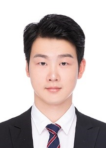

 
# <u>CV-XIN LIU</u> [🔗GitHub](https://github.com/Cherishlxin/xinCV)
## 基本信息
<!--
[myselfo](selfo.jpg){ width=300 height=200 }
-->

<pre>
生年月：1995.10.06　　         名族：汉
政治面貌：中共党员　　           籍贯：湖北省随州市
邮箱: xl17g20@soton.ac.uk     电话: (+86) 130 0712 9982
</pre>

<table style="border: none!important; border-collapse: collapse!important; line-height: 1.4;">
<tr>
<td style="border: none!important; width: 50%; padding: 2px 8px;">生年月：1995.10.06</td>
<td style="border: none!important; padding: 2px 8px;">名族：汉</td>
</tr>
<tr>
<td style="border: none!important; padding: 2px 8px;">政治面貌：中共党员</td>
<td style="border: none!important; padding: 2px 8px;">籍贯：湖北省随州市</td>
</tr>
<tr>
<td style="border: none!important; padding: 2px 8px;">📧 邮箱: xl17g20@soton.ac.uk  </td>
<td style="border: none!important; padding: 2px 8px;">电话: (+86) 130 0712 9982 </td>
</tr>
</table>  

- **生年月**：1995.10.06
- **名族**：汉
- **政治面貌**：中共党员
- **籍贯**：湖北省随州市
- **📧 邮箱**：xl17g20@soton.ac.uk
- **电话**：(+86) 130 0712 9982

  
生年月：1995.10.06　　名族：汉

  
政治面貌：中共党员　　籍贯：湖北省随州市

  
📧 邮箱: xl17g20@soton.ac.uk　　电话: (+86) 130 0712 9982

  

    生年月：1995.10.06
    名族：汉
  

  

    政治面貌：中共党员
    籍贯：湖北省随州市
  

  

    📧 邮箱: xl17g20@soton.ac.uk
    电话: (+86) 130 0712 9982
  

**研究方向**：多载波通信（OFDM/OTFS），信道编码，量子密钥分发（QKD），无线通信，雷达通信系统信号处理

---
## 🎓 教育背景
  - 英国南安普顿大学(QS81)，博士，通信工程，2021.02 – 2025.02，导师：Lajos Hanzo，Southampton, UK
  - 华中科技大学(保研)，硕士，信息与通信工程，2017.09 – 2020.06，均分: 91.68/100, 排名: 1/130， 武汉
  - 武汉理工大学，学士，通信工程，2013.09 – 2017.06，均分: 93.60/100, 排名: 1/229， 武汉
---

## 💼  研究项目
  - ***基于接近信道容量的前向纠错码在连续变量量子密钥分发中的应用研究，2021.02 -- 2025.02，国家留学基金委基金项目(CSC: 202006160015)*** 
    >- 不同于现有基于LDPC 校验子的QKD 协商过程，本项目提出了一种基于码字的QKD 协商过程。首先，该协议能够同时提供量子信道和经典信道的双重保护；其次，协议设计确保协商双方具有相近的译码复杂度；最后，所提出的方案兼容不同类型的前向纠错码，特别是对于码长较长的LDPC 和IRCC 码，能够提供接近信道容量的协商性能，从而有效提升安全密钥率。(投稿于IEEE OJCOMS, 期刊[5])
    >- 为了保障控制信道的安全性，本项目提出了一种基于码字协商的短码极化码QKD 协商过程。首先，该协议在短码情况下能够为控制信道提供优异的协商性能，适用于控制信道信息的加密保护。此外，协议设计确保协商双方具有相近的译码复杂度；通过对比基于直接纠错和反向纠错的协商协议在秘钥率方面的表现，指出了两种不同协商算法的适用场景。(计划投稿中，期刊[3]-在投)基于多载波
  - ***基于多载波OFDM/OTFS 量子传输的连续变量量子秘钥分发系统研究，2021.02 -- 2025.02，国家留学基金委基金项目(CSC: 202006160015)***
    >- 考虑到太赫兹传输过程中的高速移动场景，本项目提出了一种基于OTFS 的时频双选太赫兹QKD 传输系统，并提出了一种改进的多维度协商算法，以应对包含小尺度衰落的信道传输环境。研究表明，在高移动场景下，基于OTFS 的CV-QKD 系统相比基于OFDM 的系统具有更优的性能，从而能够提供更远的安全传输距离。此外，考虑到基于模拟波束赋形的多天线MIMO 模型，研究表明增加天线数量有助于进一步扩展安全传输距离。(投稿于IEEE TCOM，期刊[4])
    >- 为进一步研究基于MIMO OFDM/OTFS 的CV-QKD系统性能，提出采用混合波束成形技术对信道进行SVD，从而在收发双方分别实现信号的预编码与联合处理。此外，考虑到收发双方在未知CSI 情况下进行信道估计对系统性能的影响，研究表明，相较于OFDM 时频域信道估计，OTFS 时延多普勒域信道估计具有更高的估计精度，从而显著提升了系统的安全传输距离。(计划投稿中，期刊[1], [2]-在投)无定形无线覆盖网络理论与关键技
  - ***无定形无线覆盖网络理论与关键技术，2017 – 2020国家自然科学基金重点项目(No. 61531011)***
    >- 总结超密集异构网络中用户采用解耦接入方式下的连接判决准则，并对不同连接判决准则下系统的SNR 覆盖率、频谱效率以及能量效率等性能指标进行相应的对比与分析。(投稿于JCIN, 期刊[6])
    >- 考虑无线回程容量受限情况下，多天线单用户场景中用户采用解耦接入方式下，对系统进行建模并采用基于无线回程容量受限的连接判决标准，分析了相应的连接概率与SNR 覆盖率。(投稿于IEEE Access, 期刊[7])
  - ***雷达通信一体化波形研究，2017 – 2020，国家装备预研国防重点实验室基金,(xxxxxx) 涉密***
    >- 基于经典通信信号OFDM 的雷达通信共享信号性能研究，对于模糊函数展开分析，以及基于OFDM 的一维目标超分辨估计与通信。

---

##  期刊发表
  - [1] <ins>**X. Liu**</ins>, C. Xu, S. X. Ng and L. Hanzo, “Analog Beamforming Assisted OTFS-Based CV-QKD Systems for Doubly Selective THz Estimated Channels,” *IEEE Transactions on Vehicular Technology*, under review. IF=6.1.
  - [2] <ins>**X. Liu**</ins>, C. Xu, S. Wang, S. X. Ng and L. Hanzo, “Hybrid Beamforming Assisted OTFS-Based CV-QKD Systems for Doubly Selective THz Channels,” *IEEE Transactions on Communications*, under review. IF=7.2.
  - [3] D. Wang, <ins>**X. Liu**</ins>, C. Xu, S. X. Ng and L. Hanzo, “Short Polar Codes are capable of Outperforming LDPC Codes in CV-QKD,” *IEEE Open Journal of Vehicular Technology*, under review. IF=5.3.
  - [4] <ins>**X. Liu**</ins>, C. Xu, S. X. Ng and L. Hanzo, “OTFS-Based CV-QKD Systems for Doubly Selective THz Channels,” *IEEE Transactions on Communications*, accepted, 2025. IF=7.2
  - [5]  <ins>**X. Liu** </ins>, C. Xu, Y. Noori, S. X. Ng and L. Hanzo, “The Road to Near-Capacity CV-QKD Reconciliation:
An FEC-Agnostic Design,” *IEEE Open Journal of the Communications Society*, vol.
5, pp. 2089-2112, 2024. IF=6.3
  - [6] <ins>**X. Liu**</ins>, R. Li, K. Luo, and T. Jiang, “Downlink and Uplink Decoupling in Heterogeneous Networks
for 5G and Beyond,” *Journal of Communications and Information Networks*, vol. 3, no. 2,
pp. 1-13, 2018. IF=3.6
  - [7] R. Li, <ins>**X. Liu**</ins>, K. Luo, T. Jiang, and S. Jin, “Decoupled Access in HetNets with Backhaul
Constrained Small Base Stations,” *IEEE Access*, vol. 6, no. 1, pp. 27028-27038, 2018. IF=3.4

---

## 🏆 获奖及荣誉
  - 博士阶段
    - CSC 国家公派留学奖学金(南安普顿大学与国家留学基金委联合奖学金，名额：10)。
  - 硕士阶段
    - “三好研究生”(2018) 荣誉称号；
    - 研究生国家奖学金(2018), 一等学业奖学金(2019, 2018, 2017)。
  - 本科阶段
    - “优秀毕业生”(2017)，“校三好学生标兵”(2016), “校三好学生”(2015), “勤奋好学先进个人” (2014) 荣誉称号；
    - 国家奖学金(2016, 2014)，校一等奖学金(2015)。
---
## 活动和工作经历
  - 博士阶段电子与计算机(ECS) 系实验助教(2022-2024): C 语言，模数电，微波传输线，通信原理，信号处理，单片机，FPGA。
  - 硕士阶段信号与系统助教(2017-2018)
  - 本科阶段学习委员(2013-2017)，自强社成员(2013-2015)
---
## 技能
  - 熟练掌握MATLAB, C, C++, GLE, Python 等编程与数据处语言；
  - 全国计算机等级考试：二级（C 语言）证书，三级（嵌入式）证书；
  - 英语四级CET-4, 英语六级CET-6 (Score: 533), 托福TOEFL (Score: 97) 证书；具有丰富的英文论文阅读写作经历，及熟练的交流沟通能力。
---
## 自我评价
为人本分踏实，责任心强；热衷于无线通信及计算机技术的研究，具备较强的学习能力，能够快速掌握并理解新知识，并高效完成各项任务；做事稳重踏实，认真负责；善于沟通与团队合作，具有较强的社会适应能力。

